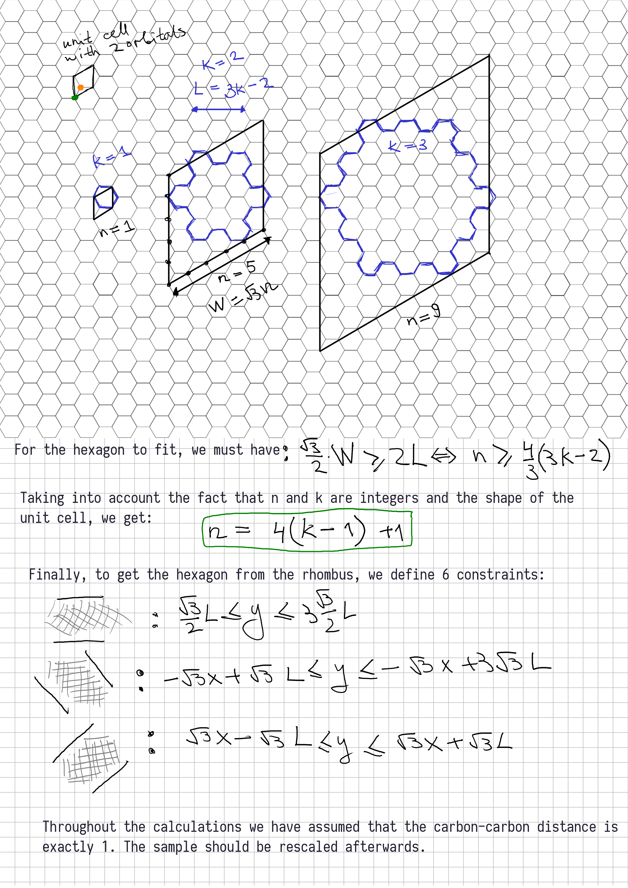
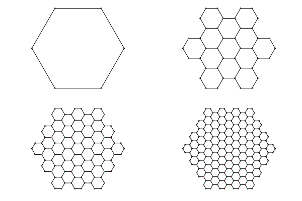
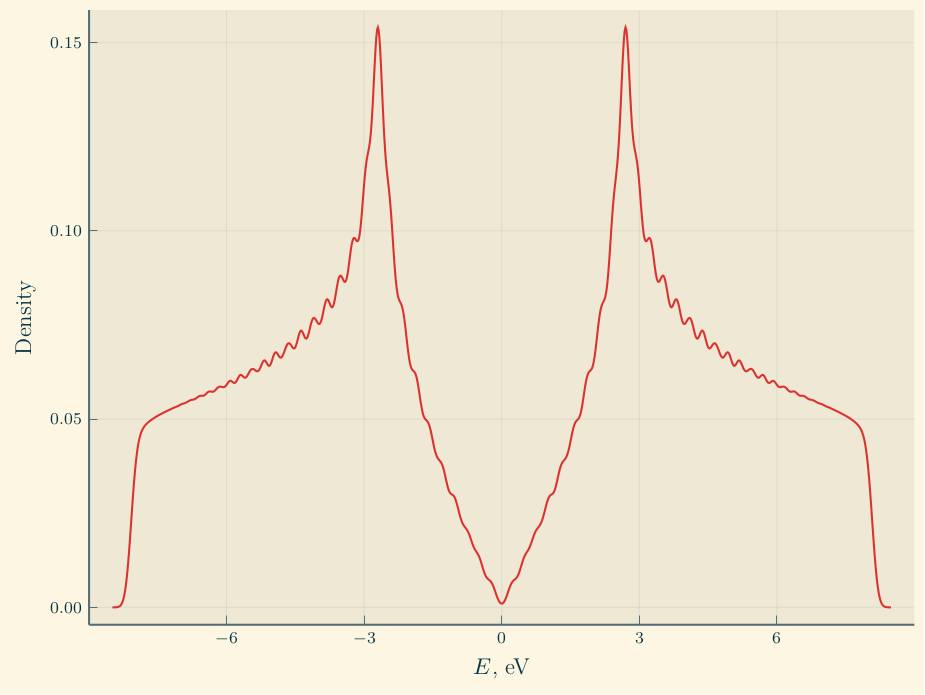
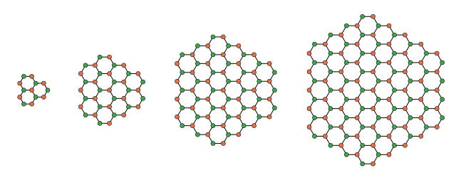
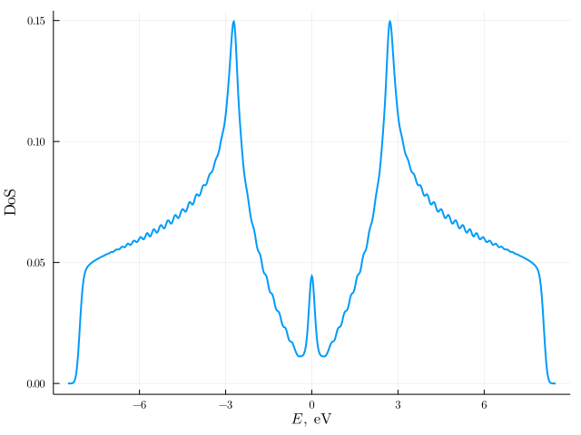

# Plasmons in single and bilayer hexagonal graphene flakes


## Geometries

### Hexagon with armchair boundaries



And this is what the code produces:




## Single-layer graphene

For now, we only consider open armchair boundaries.

### Constructing the sample

Let us start with constructing the tight-binding Hamiltonian:

```julia
using GraphenePlasmons
single_layer_graphene_1626("data/single_layer/input_1626.h5")
```

This will create an HDF5 called `input_1626.h5` in `data/single_layer` folder
with the tight-binding Hamiltonian for 1626-site sample.

> :information_source: **Note:** all code samples here assume that your enter
> commands directly into Julia REPL. You can also use them as standalone shell
> commands. For example, the above snippet can alternatively be invoked directly
> from bash:
>
> ~~~~sh
> julia -e 'using GraphenePlasmons; single_layer_graphene_1626("data/single_layer/input_1626.h5")'
> ~~~~

We can verify that we got the boundary conditions right by plotting density of
states:

```julia
setup_plots!()
p = plot_density_of_states(density_of_states("data/single_layer/input_1626.h5", σ=0.1)...);
savefig(p, "assets/single_layer/density_of_states_1626.png")
```



Density of states indeed goes to zero at zero energy, i.e. we have a
"semiconductor".


### Constructing samples with zigzag boundaries

```julia
plot_example_zigzag_samples("assets/single_layer/example_zigzag_samples.png")
```




We can also compute the density of states:

```julia
single_layer_graphene_1633("data/single_layer/input_zigzag_1633.h5")
plot_density_of_states(density_of_states("data/single_layer/input_zigzag_1633.h5", σ=0.09)...;
                       output = "assets/single_layer/density_of_states_zigzag_1633.png")
```




### Calculating polarizability χ(ω)

| Parameter      | Value                  |
|----------------|------------------------|
| t              | 2.7 eV                 |
| k<sub>kT</sub> | 0.0256 eV (i.e. 300 K) |
| μ              | 0 eV                   |
| η              | 0.001 eV               |

[`run_cartesius.sh`](./tools/run_cartesius.sh) file shows an example SLURM
script which can be used on Cartesius to calculate polarizability matrix χ for a
variety of frequencies ω. It parallelizes the computation between 2 GPUs.
Afterwards, `GraphenePlasmons.combine_outputs` function can be used to combine
multiple HDF5 output files into one.
